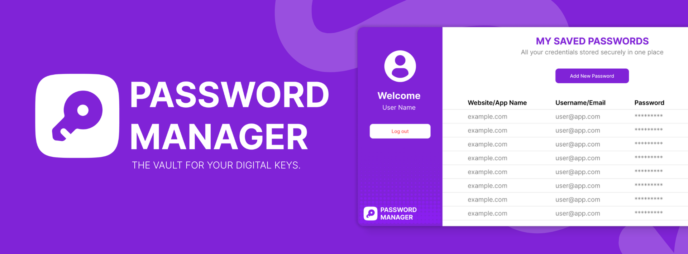

# 🔐 Simple Password Manager

A secure and user-friendly desktop application developed using Java and JavaFX. It allows users to safely store, view, and manage their passwords, with user roles for guests, registered users, and admins.




## 📋 Table of Contents
- [Features](#features)
- [Application Overview](#application-overview)
- [OOP Concepts](#oop-concepts)
- [Installation](#installation)
- [Usage](#usage)
- [Project Structure](#project-structure)
- [Future Enhancements](#future-enhancements)
- [Team Members](#team-members)
- [Contributing](#contributing)

## ✨ Features

### 🔐 Security Features
- **Secure Login System** - User authentication with encrypted passwords
- **Password Encryption** - All stored passwords are encrypted using AES encryption
- **User Role Management** - Different access levels for guests, users, and admins
- **Data Protection** - CSV-based encrypted data storage

### 👥 User Management
- **Guest Mode** - Limited access with demo data for testing
- **User Registration** - Create new user accounts with email validation
- **Admin Panel** - Administrative controls for user management
- **User Profiles** - Manage personal account information

### 📊 Password Management
- **Add Passwords** - Store new password entries securely
- **View Passwords** - Display stored passwords with decryption
- **Edit Passwords** - Update existing password information
- **Delete Passwords** - Remove unwanted password entries
- **Search & Filter** - Find specific passwords quickly

## 🖥️ Application Overview

- **Platform**: Standalone JavaFX desktop application
- **Interface**: Simple and user-friendly GUI
- **Authentication**: Secure login and registration system
- **Storage**: CSV-based encrypted data storage
- **Operations**: Password viewing, editing, deleting
- **Administration**: Admin-only user management
- **Demo Mode**: Guest mode with limited access

## 🎯 OOP Concepts

This project demonstrates the four fundamental OOP concepts:

### 1. **Encapsulation** 🔒
- Private fields in `BaseUser` and `BasePasswordEntry` classes
- Controlled access through public getter/setter methods
- Data protection from unauthorized access

### 2. **Abstraction** 🎭
- Abstract classes `BaseUser` and `BasePasswordEntry`
- Hide complex implementation details
- Define contracts for subclasses

### 3. **Inheritance** 🧬
- `User` class extends `BaseUser`
- `PasswordEntry` class extends `BasePasswordEntry`
- Code reuse and extension of functionality

### 4. **Polymorphism** 🔄
- Different implementations of `getDecryptedPassword()` method
- Same method name, different behavior in User vs Guest modes
- Runtime method resolution

## 🚀 Installation

### Prerequisites
- Java 17 or higher
- Maven 3.6 or higher
- JavaFX SDK

### Setup Steps

1. **Clone the repository**
   ```bash
   git clone https://github.com/your-username/simple-password-manager.git
   cd simple-password-manager
   ```

2. **Install dependencies**
   ```bash
   mvn clean install
   ```

3. **Run the application**
   ```bash
   mvn javafx:run
   ```

## 💻 Usage


### Getting Started
1. **Launch the application**
2. **Choose your mode**:
   - **Guest Mode**: Try the app with demo data
   - **Login**: Access your existing account
   - **Register**: Create a new account

### For Regular Users
- Add new password entries
- View, edit, or delete existing passwords
- Manage your account profile
- Secure logout

### For Administrators
- Manage user accounts
- View system statistics
- Configure application settings
- Access admin-only features

## 📁 Project Structure

```
simple-password-manager/
├── src/
│   └── main/
│       ├── java/
│       │   └── com/example/
│       │       ├── controllers/     # JavaFX Controllers
│       │       ├── models/         # Data Models
│       │       ├── utils/          # Utility Classes
│       │       └── App.java        # Main Application
│       └── resources/
│           ├── com/example/
│           │   ├── css/           # Stylesheets
│           │   ├── fxml/          # UI Layouts
│           │   └── images/        # Application Images
│           └── data/              # Data Storage
├── target/                        # Compiled Classes
├── pom.xml                       # Maven Configuration
└── README.md                     # Project Documentation
```

## 🔮 Future Enhancements

### Planned Features
- **🔄 Backup Options**: Cloud and local backup classes
- **🔐 More Security**: Add two-factor authentication
- **🎨 Multiple Themes**: Add DarkTheme, LightTheme classes implementing color themes
- **📱 Different Password Types**: Add CreditCardEntry, BankAccountEntry extending BasePasswordEntry

### Technical Improvements
- Database integration (SQLite/MySQL)
- Cross-platform compatibility
- Password strength analysis
- Import/Export functionality
- Mobile companion app

## 👨‍💻 Team Members

Meet the main project team behind **Password Manager** — a group of second-year ICT undergraduates from Uva Wellassa University, passionate about building meaningful digital solutions together.

| Name | GitHub | LinkedIn |
|------|--------|----------|
| **Theekshana Nirmal** | [@theekshana-nirmal](https://github.com/theekshana-nirmal) | [LinkedIn](https://www.linkedin.com/in/theekshana-nirmal-bandara/) |
| **Nethma Malshani** | [@Nethmamlshni](https://github.com/Nethmamlshni) | [LinkedIn](https://www.linkedin.com/in/nethma-malshani-1a3a89339/) |
| **Nimna Kshithija** | [@Nimna92](https://github.com/Nimna92) | [LinkedIn](https://www.linkedin.com/in/nimna-kshithija-9a8377314/) |
| **Dasun Yapa** | [@dasun-yapa](https://github.com/dasun-yapa) | [LinkedIn](https://www.linkedin.com/in/dasun-yapa-a57405342/) |
| **Dasun Dilshan** | [@dasun-dilshan](https://github.com/) | [LinkedIn](https://www.linkedin.com/) |

## 🤝 Contributing

We welcome contributions! Please follow these steps:

1. Fork the repository
2. Create a feature branch (`git checkout -b feature/AmazingFeature`)
3. Commit your changes (`git commit -m 'Add some AmazingFeature'`)
4. Push to the branch (`git push origin feature/AmazingFeature`)
5. Open a Pull Request

## 📞 Support

If you have any questions or need help, feel free to:
- Open an issue on GitHub
- Contact any of our team members
